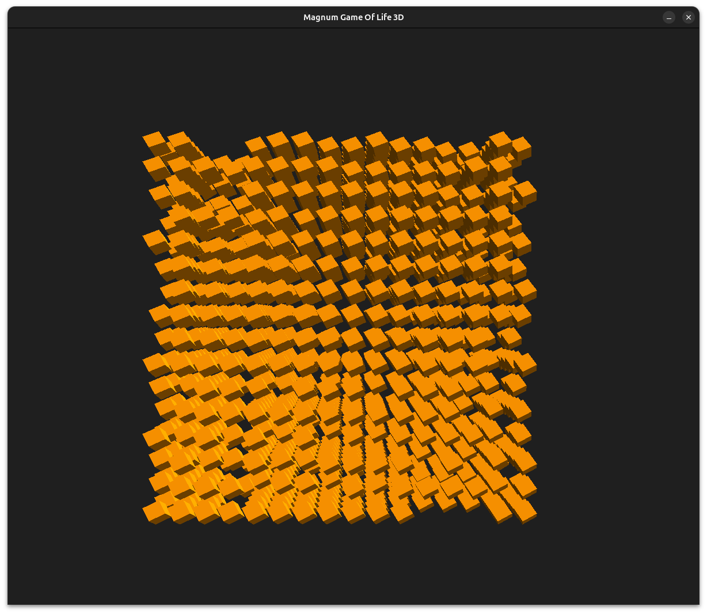
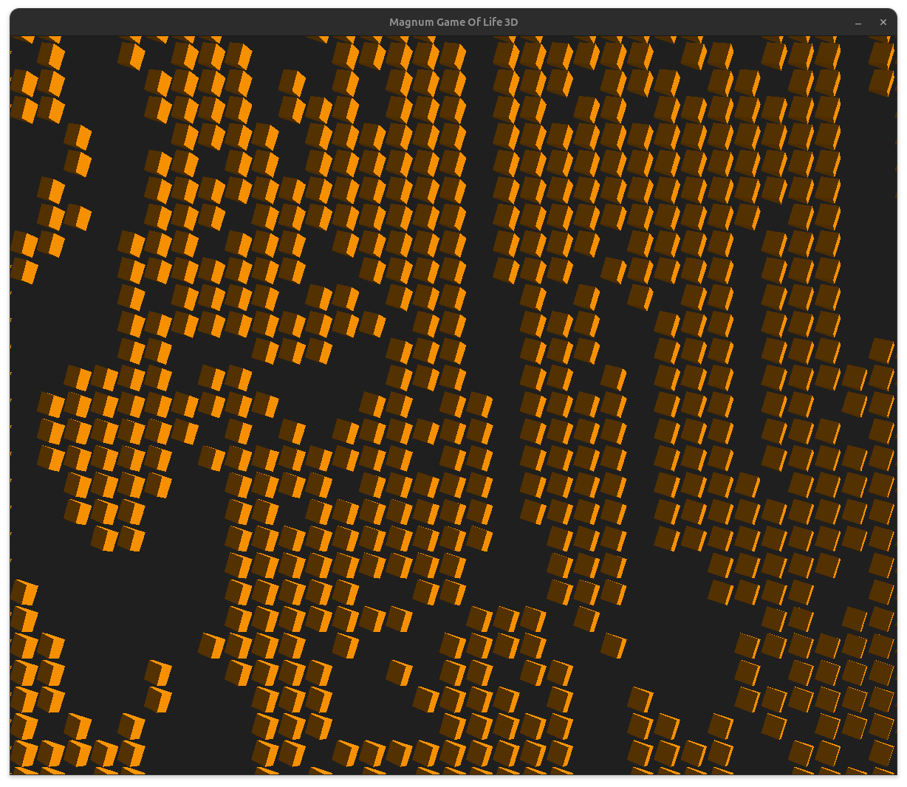

# magnum-game-of-life-3d
C/C++ game of life 3D project visualized with magnum.

This project is mainly based on the C/C++ libraries: 
grapic library https://magnum.graphics/ as well https://magnum.graphics/corrade/ for utility functions. 

For building magnum and corrade from scratch checkout the repo from https://github.com/mosra/magnum and https://magnum.graphics/corrade/.
Important: Build the corrade project before building the magnum project.

Building the corrade project:
 ```
cd corrade 
mkdir build && cd build
cmake ..
cmake --build .
 ```

Building the magnum project:
```
cd magnum
mkdir build && cd build
cmake ..\ 
   -DMAGNUM_WITH_SDL2APPLICATION=ON
 && make 
 && make install
```

After building the magnum project you can build this C/C++ project.

The game of life project has following order structure: 

```
./build
./CMakeLists.txt
./corrade -> ../../corrade/
./magnum -> ../../magnum/
./modules
./README.md
./Screenshot-1.png
./Screenshot-2.png
./Screenshot-3.png
./src
```

Same as before: 

```
cd magnum-game-of-life
mkdir build && cd build
cmake ..
cmake --build .
```





Some results with different configurations:

/bin/MagnumGameOfLife --dimension 32 --computemode 1

```
Computing took 0.00742187s with mode: CPUSerial
Computing took 0.00565313s with mode: CPUSerial
Computing took 0.00623309s with mode: CPUSerial
Computing took 0.00578718s with mode: CPUSerial
Computing took 0.00568398s with mode: CPUSerial
Computing took 0.00676035s with mode: CPUSerial
Computing took 0.00653602s with mode: CPUSerial
Computing took 0.00592304s with mode: CPUSerial
Computing took 0.00611048s with mode: CPUSerial
Computing took 0.00593799s with mode: CPUSerial
Computing took 0.00599404s with mode: CPUSerial
Computing took 0.00687863s with mode: CPUSerial
Computing took 0.00660276s with mode: CPUSerial
Computing took 0.00679046s with mode: CPUSerial
Computing took 0.00567988s with mode: CPUSerial
Computing took 0.00575742s with mode: CPUSerial
Computing took 0.00578882s with mode: CPUSerial
Computing took 0.00594202s with mode: CPUSerial
```

/bin/MagnumGameOfLife --dimenseion 32 --computemode 2

```
Computing took 0.00172155s with mode: CPUParallel
Computing took 0.00105463s with mode: CPUParallel
Computing took 0.000949706s with mode: CPUParallel
Computing took 0.00104956s with mode: CPUParallel
Computing took 0.0011585s with mode: CPUParallel
Computing took 0.000895827s with mode: CPUParallel
Computing took 0.00127591s with mode: CPUParallel
Computing took 0.000948812s with mode: CPUParallel
Computing took 0.000963206s with mode: CPUParallel
Computing took 0.00112893s with mode: CPUParallel
Computing took 0.000975872s with mode: CPUParallel
Computing took 0.000988148s with mode: CPUParallel
Computing took 0.000924745s with mode: CPUParallel
Computing took 0.000995989s with mode: CPUParallel
Computing took 0.00107612s with mode: CPUParallel
Computing took 0.00115494s with mode: CPUParallel
Computing took 0.00109494s with mode: CPUParallel
Computing took 0.000876133s with mode: CPUParallel
```

/bin/MagnumGameOfLife --dimension 32 --computemode 2

```
Computing took 0.0699127s with mode: GPUParallel
Computing took 0.000171408s with mode: GPUParallel
Computing took 0.000175476s with mode: GPUParallel
Computing took 0.000176083s with mode: GPUParallel
Computing took 0.000177023s with mode: GPUParallel
Computing took 0.000176546s with mode: GPUParallel
Computing took 0.000177566s with mode: GPUParallel
Computing took 0.000176215s with mode: GPUParallel
Computing took 0.000214109s with mode: GPUParallel
Computing took 0.000200467s with mode: GPUParallel
Computing took 0.000468735s with mode: GPUParallel
Computing took 0.000176499s with mode: GPUParallel
Computing took 0.000402352s with mode: GPUParallel
Computing took 0.000174336s with mode: GPUParallel
Computing took 0.000173134s with mode: GPUParallel
Computing took 0.000191444s with mode: GPUParallel
Computing took 0.000180986s with mode: GPUParallel
Computing took 0.000169251s with mode: GPUParallel
Computing took 0.000172731s with mode: GPUParallel
Computing took 0.000184641s with mode: GPUParallel
Computing took 0.00017047s with mode: GPUParallel
Computing took 0.000173116s with mode: GPUParallel
Computing took 0.000171859s with mode: GPUParallel
Computing took 0.000166565s with mode: GPUParallel
Computing took 0.00079048s with mode: GPUParallel
Computing took 0.000210384s with mode: GPUParallel
Computing took 0.000174102s with mode: GPUParallel
```

/bin/MagnumGameOfLife --dimension 64 --computemode 1

```
Computing took 0.0555197s with mode: CPUSerial
Computing took 0.0539763s with mode: CPUSerial
Computing took 0.0545522s with mode: CPUSerial
Computing took 0.0543793s with mode: CPUSerial
Computing took 0.0544335s with mode: CPUSerial
Computing took 0.053008s with mode: CPUSerial
Computing took 0.0563637s with mode: CPUSerial
Computing took 0.0537417s with mode: CPUSerial
Computing took 0.053884s with mode: CPUSerial
Computing took 0.0531526s with mode: CPUSerial
Computing took 0.0570132s with mode: CPUSerial
Computing took 0.0548666s with mode: CPUSerial
Computing took 0.0551864s with mode: CPUSerial
Computing took 0.0569083s with mode: CPUSerial
Computing took 0.053993s with mode: CPUSerial
Computing took 0.0525571s with mode: CPUSerial
Computing took 0.0554101s with mode: CPUSerial
Computing took 0.054908s with mode: CPUSerial
Computing took 0.0529288s with mode: CPUSerial
Computing took 0.0561799s with mode: CPUSerial
```

./bin/MagnumGameOfLife --dimension 64 --computemode 2

```
Computing took 0.0114412s with mode: CPUParallel
Computing took 0.0126738s with mode: CPUParallel
Computing took 0.0114358s with mode: CPUParallel
Computing took 0.014497s with mode: CPUParallel
Computing took 0.0103546s with mode: CPUParallel
Computing took 0.0101551s with mode: CPUParallel
Computing took 0.0116963s with mode: CPUParallel
Computing took 0.0105105s with mode: CPUParallel
Computing took 0.0124741s with mode: CPUParallel
Computing took 0.0123243s with mode: CPUParallel
Computing took 0.0114928s with mode: CPUParallel
Computing took 0.0124942s with mode: CPUParallel
Computing took 0.0126372s with mode: CPUParallel
Computing took 0.0102884s with mode: CPUParallel
Computing took 0.0114197s with mode: CPUParallel
Computing took 0.0110162s with mode: CPUParallel
Computing took 0.012086s with mode: CPUParallel
Computing took 0.0114237s with mode: CPUParallel
Computing took 0.0121604s with mode: CPUParallel
Computing took 0.0128584s with mode: CPUParallel
```

/bin/MagnumGameOfLife --dimension 64 --computemode 3

```
Computing took 0.00124912s with mode: GPUParallel
Computing took 0.000543594s with mode: GPUParallel
Computing took 0.000573824s with mode: GPUParallel
Computing took 0.000461596s with mode: GPUParallel
Computing took 0.000441742s with mode: GPUParallel
Computing took 0.000460211s with mode: GPUParallel
Computing took 0.000465593s with mode: GPUParallel
Computing took 0.000603652s with mode: GPUParallel
Computing took 0.000529718s with mode: GPUParallel
Computing took 0.000520486s with mode: GPUParallel
Computing took 0.000515063s with mode: GPUParallel
Computing took 0.000519765s with mode: GPUParallel
Computing took 0.001021s with mode: GPUParallel
Computing took 0.000516255s with mode: GPUParallel
Computing took 0.000456314s with mode: GPUParallel
Computing took 0.000453337s with mode: GPUParallel
Computing took 0.000493486s with mode: GPUParallel
Computing took 0.00108582s with mode: GPUParallel
Computing took 0.000460295s with mode: GPUParallel
```
